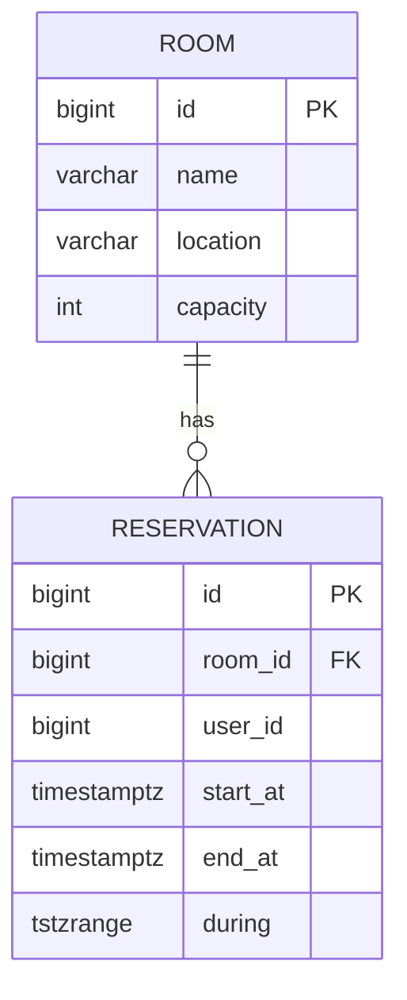

# synclife-studyroom

PostgreSQL `tstzrange + EXCLUDE USING gist`로 **동시성에서도 겹치는 예약을 DB 레벨에서 차단**하는 스터디룸 예약 백엔드.

## Features
- Rooms
  - `POST /rooms` (ADMIN 전용): 회의실 등록
  - `GET /rooms?date=YYYY-MM-DD` : 특정 **UTC 날짜**의 예약/빈 시간대 조회
- Reservations
  - `POST /reservations` (USER): 예약 생성 — **겹침 금지**
  - `DELETE /reservations/{id}` (OWNER or ADMIN): 예약 취소
- RBAC: 간단 토큰(`admin-token`, `user-token-<id>`)
- 동시성 보장: PostgreSQL `EXCLUDE` 제약 + 동시성 테스트(병렬 10건 → 1건 성공)

## Tech Stack
- Java 21, Spring Boot 3.5
- Spring Web / Data JPA / Validation / springdoc-openapi
- PostgreSQL 16, HikariCP
- Build: Gradle

## Quick Start

### 0) Prerequisites
- Docker / Docker Compose
- JDK 21

### 1) DB 기동
```bash
docker compose up -d
```

### 2) 앱 실행
```bash
# macOS/Linux
./gradlew clean bootRun

# Windows PowerShell
.\gradlew clean bootRun
```

- Swagger UI: http://localhost:8080/docs  
  (우상단 **Authorize** → `admin-token` 또는 `user-token-<id>` 입력)

## Auth (간단 토큰 규칙)
- ADMIN: `admin-token`
- USER : `user-token-<id>` 예) `user-token-7`
- 헤더 없음 → **401 UNAUTHORIZED**
- 권한 부족 → **403 FORBIDDEN**

요청 헤더 예:
```
Authorization: Bearer admin-token
Authorization: Bearer user-token-7
```

## API Summary
- **POST /rooms** (ADMIN) → 201 Created
- **GET /rooms?date=YYYY-MM-DD** → 200 OK  
  - 날짜는 **UTC 기준**, 해당 일자 `[00:00Z, 24:00Z)`의 예약/빈 슬롯 반환
- **POST /reservations** (USER) → 201 Created  
  - `startAt < endAt`(UTC), 반개구간 `[start, end)`  
  - 겹침 시 409 CONFLICT (`code: OVERLAP`)
- **DELETE /reservations/{id}** (OWNER or ADMIN) → 204 No Content

## ERD



- 시간 모델: **UTC**, 반개구간 `[start, end)`  
- 겹침 금지: `tstzrange` + **`EXCLUDE USING gist`**

## 설계

### 겹침 방지(동시성 무결성)
- **DB 1차 방어선**: PostgreSQL `EXCLUDE` 제약이 경쟁 상태에서도 1건만 허용
- 애플리케이션은 DB 예외를 잡아 **409(CONFLICT, code=OVERLAP)** 로 매핑
  - 제약명(`reservations_no_overlap`) 또는 SQLSTATE(23P01)로 식별

### RBAC
- `Authorization` 헤더 파싱 필터로 ADMIN / USER 구분
- Swagger 리소스(`/docs`, `/v3/api-docs`, `/swagger-ui*`)는 필터 우회

## ADR
- [ADR-001: 예약 겹침 방지 전략](docs/adr-001-overlap-guard.md) — PostgreSQL `tstzrange + EXCLUDE USING gist`로 겹침 차단, 제약명/SQLSTATE로 409 매핑
- [ADR-002: RBAC 간소화 방식](docs/adr-002-rbac-simplified.md) — `Authorization: Bearer ...` 토큰 파싱 필터로 ADMIN/USER 간단 분리

## 테스트
- 같은 시간대 병렬 INSERT 10개 → 1건 성공 검증
